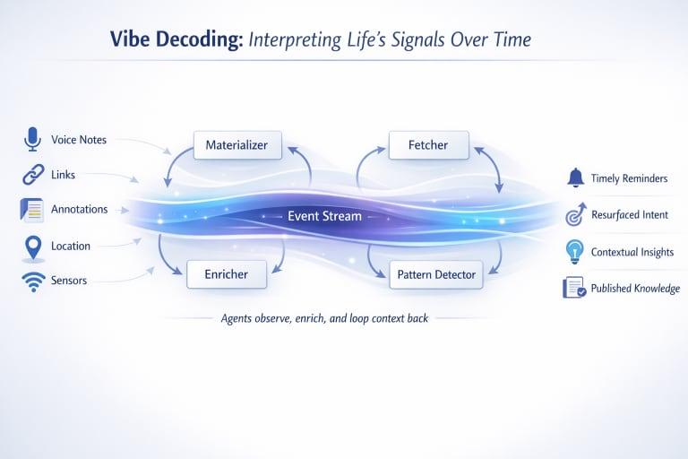

# Vibe Decoding

**Turning life's ambient signals into timely action.**

Vibe Decoding is a reference architecture for building your own personal signal processing system. It captures the continuous stream of signals we generate—bookmarks saved, notes taken, articles read, ideas sparked—and transforms them into actionable insights that surface at the right moment.



## The Problem

We're surrounded by information, but starved for insight. The bookmark you saved six months ago that's suddenly relevant. The connection between two ideas you had weeks apart. The pattern in your interests that you've never noticed.

These signals exist. They're scattered across apps, notes, and memory. The challenge isn't capturing them—we're already doing that, perhaps too well. The challenge is *decoding* them: extracting meaning, surfacing connections, and triggering action at the right moment.

## The Architecture

At the heart of Vibe Decoding is the **life stream**—a unified event log of your digital interactions. Every link saved, every note written, every highlight captured becomes an event in this stream.

**Events → Enrichment → Context → Insight → Action**

The system uses:

- **Kafka** for durable event streaming and transport
- **AI Agents** (powered by LLMs) for enrichment—fetching content, generating summaries, extracting tags
- **Supabase/Postgres** for structured storage and querying
- **Flink** (coming soon) for real-time stream processing and pattern detection

## Repository Structure

```
vibedecoding/
├── stream-agents/          # Core event processing system
│   ├── scripts/            # Agent implementations
│   │   ├── agent_fetcher.ts      # Fetches and extracts URL content
│   │   ├── agent_enricher.ts     # LLM-powered tagging and summarization
│   │   ├── publish_events_to_kafka.ts    # DB → Kafka publisher
│   │   └── consume_kafka_materialize.ts  # Kafka → DB materializer
│   ├── src/lib/            # Shared utilities
│   │   ├── db.ts           # Database client and types
│   │   ├── kafka.ts        # Kafka client configuration
│   │   └── subject_id.ts   # Stable entity identification
│   ├── infrastructure/     # Terraform for Kafka (EC2 or MSK)
│   └── schema.sql          # Database schema
│
└── vibedecoding.io/        # Documentation website (Astro)
    └── src/content/guide/  # Architecture guides
```

## Key Concepts

### Events as Facts

Events are immutable facts about what happened. State is derived from events, not stored directly. This gives you time travel, replay capability, and complete auditability.

### Subject IDs

Every entity gets a stable, deterministic identifier. A link's ID is derived from its normalized URL. This ensures the same link saved twice produces the same ID, enabling correlation across time and sources.

### Agents

Single-purpose consumers that transform events. The fetcher agent extracts content from URLs. The enricher agent calls an LLM for tagging and summarization. The materializer projects events into queryable tables. Each agent is independent and idempotent.

## Getting Started

See the [Getting Started](https://vibedecoding.io/getting-started) page for setup instructions, or dive into the code:

```bash
cd stream-agents
bun install
cp .env.example .env
# Configure your environment variables
bun run kafka:init
bun run seed
```

## Documentation

The full guide series is available at [vibedecoding.io](https://vibedecoding.io):

- **[Part 0: Vibe Decoding](https://vibedecoding.io/guide/vibe-decoding)** — Conceptual introduction
- **[Part 1: Event Model & Life Stream](https://vibedecoding.io/guide/life-stream-architecture)** — Event architecture and subject IDs
- **[Part 2: Agents & Enrichment](https://vibedecoding.io/guide/agents-enrichment)** — Fetcher, enricher, and materializer
- **[Part 3: Kafka Patterns](https://vibedecoding.io/guide/kafka-patterns)** — Topics, consumers, and infrastructure
- **[Part 4: Flink](https://vibedecoding.io/guide/flink-time)** — Real-time stream processing (conceptual)
- **[Part 5: Voice & Context](https://vibedecoding.io/guide/voice-context)** — Extending beyond text

## Why "Vibe"?

The word "vibe" captures something important: we're not trying to build a perfect knowledge graph or a comprehensive database. We're trying to capture the *feel* of what you're interested in, the *direction* of your thinking, the *energy* around certain topics.

Vibes are fuzzy. They're contextual. They change over time. That's a feature, not a bug.

## License

MIT
